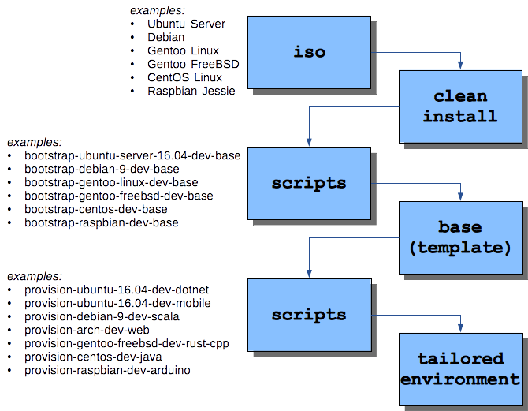

# Provision lightweight development environments

A _base_ instance provides a template for provisioning environments tailored for different kinds of development and testing work. 

The term _lightweight development environment_ means an environment configured with minimal GUI support and a text editor rather than IDEs. It is for developers who prefer working on the command line _and_ who don't need a specialized IDE for a particular platform (Arduino, R, zOS) or to work with a language that benefits greatly from an IDE (Java, Groovy). 

For most purposes, the instance will be usable as a 512 MB VM, and can be containerized or loaded onto a small computer such as a Raspberry Pi. 

- [Create base (template) instances](base-general.md)
- How to build a base instance for...
- - [Linux: CentOS 7](http://github.com/neopragma/bootstrap-centos-7-dev-base)
- - [Linux: Debian 9](http://github.com/neopragma/bootstrap-debian-9-dev-base)
- - [Linux: Gentoo](in-development.md)
- - [Linux: Ubuntu 16.04 LTS](http://github.com/neopragma/bootstrap-ubuntu-server-16.04-dev-base)
- - [Linux: Raspberry Pi: Raspbian Jessie](in-development.md)
- [Common configuration](common-configuration.md)
- [NeoVim configuration](neovim-configuration.md)

## The general idea 



## Tips

Provisioning begins with a bash script that you run on a clean install. The script prepares the environment to run Chef, installs Chef DK, and starts chef-client to complete the process.

I find it useful to watch progress by tailing the output. After you complete the manual step to clone the git repository, use ctrl-alt-F2 to switch to tty2. Use ctrl+alt+F1 and F2 to switch between the two. 

Log in as ```root ``` in both tty1 and tty2. 

In tty1:

```shell 
cd bootstrap-centos-7-dev-base 
touch bootstrap.out 
```

In tty2:

```shell 
cd bootstrap-centos-7-dev-base 
tail -f bootstrap.out 
```

In tty1:

```shell 
./bootstrap 2>&1> bootstrap.out 
```

Then you can watch for errors in tty2.
