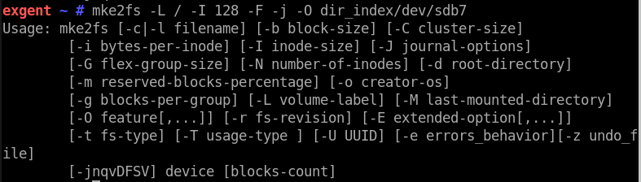
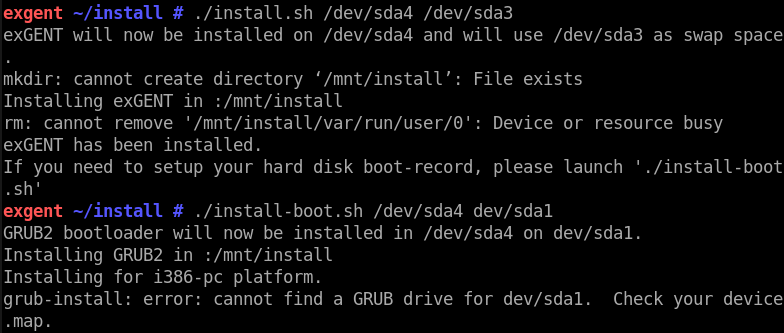
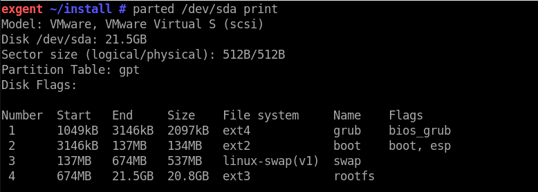

[top](../../README.md) =&gt; [Failures](../failures.md)

## exGENT Gentoo: First attempt: FAIL

I'm not sure how mature this distro is, as the website shows only 6 reviews and 84 total downloads. The wiki is empty, as if they used a site generator to produce the site and it provided a skeleton wiki section. I was unable to find any documentation. 

I tried bringing up the iso with VMware Fusion. It presented several boot options, but there is no explanation of what they mean. I chose the first one in the list. It brought up a login screen with a sports car background image. There was no indication of what login credentials to use.

I tried ```root``` with password ```root```. Initially, I thought it would be impossible to try to login, as the Tab key is not recognized. I hit Enter, thinking it would present an error message with a retry option, but instead it moved the cursor to the password field. Okay. The Principle of Least Astonishment comes to mind, for some reason. 

This took me into the LXQt graphical desktop environment.

It looked like a normal desktop system, but what is one expected to do at this point? Is there an installation procedure, or is this intended to be usable as-is?

I explored the UI and found that programs listed in the menu started normally. I changed the monitor resolution and put myself in a bind; the screen didn't fit my monitor and I couldn't reach the panel at the bottom of the display. I tried "restart" from VMware to see if the system would remember the new resolution or revert to the original.

At first it said "Boot failed, press any key to retry." Fortunately, the retry worked. The monitor resolution had reverted to the default. So, this was not an installer, but a live system. 

I restarted again so I could try another boot option. I tried "Boot from first hard disk," and got "Failed to load COM32 file chain.c32". After a timeout period, it rebooted to the initial boot menu.

Couldn't think of much else to try at that point. I booted into the live environment and saved a file, then restarted again to see if the file was still there. I opened a terminal and ran

```shell
echo 'Here is some text.' > testfile.txt
```

Then I restarted via VMware. The file ```testfile.txt``` was not there. Unsurprising in view of the earlier monitor resolution change.

The desktop environment was far more responsive than the similar-looking Redcore distro, so I was loathe to give up on it too soon. I browsed around the live system looking for any sort of hint as to how to install. There was nothing. 

Searching through every page of the project home site, I noticed that not only the wiki section but also the discussion forum and issues sections are unpopulated. It looks like a nearly-empty boilerplate site template. Either the site is brand new and hasn't been fleshed out yet, or no one is maintaining it. 

I noticed a single reference to an external soure of information: [http://exgent.exton.net](http://exgent.exton.net).

In a not-very-clear way, that article suggested running the following sequence of commands. 

```shell
emerge --sync
emerge --oneshot portage
emerge --ask --update --newuse --deep --with-bdeps=y @world
emerge --depclean
revdep-rebuild 
```

The ```emerge --sync``` command ran for about 20 minutes, spewing ```no space left on device``` and ```content ignored from this failed directory``` hundreds and hundreds of times.

The ```emerge --oneshot portage``` command responded with ```!!! Your current profile is invalid``` and so forth. 

Obviously there was no need to continue, but I tried the next command anyway just in case the previous messages were bogus.

The ```emerge --ask``` command got ```!!! Your current profile is invalid``` etc.

The ```emerge --depclean``` command got ```!!! Your current profile is invalid``` etc.

The ```revdep-rebuild``` command got ```command not found```.

FAIL.

## exGENT Gentoo: Second attempt: FAIL

Despite numerous negative experiences with overhyped "easy" Linux distros, I felt the urge to take a second look at exGENT. The instructions claim you can install to disk in 2 to 8 minutes. Naturally, I was highly, highly skeptical. I have never seen such claims come true, in regard to _any_ software. (Ultimately I spent about 12 hours trying to make it work, so I would say my skepticism was justified.)

The "live" version runs in ram and is very fast, and appears to work well except that there's no way to save anything. Any work you do and any changes you make to the system go away when you shut down. It's only useful as a toy. 

The only source of information about this distro is a sort of blog written by the author of exGENT. He has posted one entry for each "release" of the distro. It occurred to me the article I had followed the first time might be adding on to information he published in an earlier post; it might not constitute the full set of installation instructions. 

I scrolled through the posts and found some instructions that ostensibly install exGENT on a hard drive. Following the instructions, I had some problems.







I found no help online for the grub-install message, so I sent an email asking for help to the author of exGENT at info at exton.se, 28 Apr 2018 16:57, which would be 01:57 in Sweden so I didn't expect a prompt reply. 

While awaiting a reply, but I re-read the documentation carefully and noticed I had made the following error: I typed ```./install-boot.sh /dev/sda4 /dev/sda1``` when I should have typed ```./install-boot.sh /dev/sda4 /dev/sda``` with the drive as the second argument, and not a partition. 

But the result of correcting this was merely:

```
GRUB2 bootloader will not we installed in /dev/sda4 on /dev/sda
Could not mount the destination device. Installation process aborted.
```

There is really no help available for these problems. I was unable to find anything similar and helpful by searching general online resources. 

I tried to chroot into the "real" environment as one normally does, even though the blog and the sample screenshot don't call for it. This only seemed to confuse the "live" system. He must have set things up differently.

My conclusion is the promised "2 to 8 minute install to disk" is a joke. With poorly-written documentation and no response to questions, it is not possible to use this distro. Possibly the original author can install this thing to disk in 8 minutes, because he knows exactly what to do. 

He did reply to me the next day, and suggested that I read the instructions carefully. He also mentioned that it is not possible to install to a partition like sda1. His instructions refer to sdb7, but my VMware VM doesn't have device /dev/sdb. That _suggests_ it is necessary to add a second virtual drive to the VMware instance, but that is not clearly stated anywhere in the instructions. 

I replied to his email with an offer to do a live pairing session with him so he could walk me through the process step by step, and he could see what I enter on my system. It seemed to me that would reveal whatever I'm doing wrong. I offered to write clearer instructions for his users based on that experience. 

No reply so far. 


