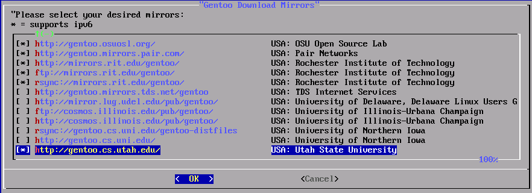

[top](../README.md) =&gt; [Failures](failures.md)

# Gentoo Linux: FAIL

## tl;dr - Gentoo did not work

I understand Gentoo is primarily for people who want to customize and build their own Linux system, but I believe that if an organization offers the option to run a "standard" out-of-the-box build, then they assume the responsibility to make sure that build works. 

Gentoo offers that, according to the [Gentoo Handbook](https://wiki.gentoo.org/wiki/Handbook:AMD64/Installation/Kernel) (see "Alternative: Using genkernel" near the end of the page).

If the user were willing to take on the challenge of build errors, they would have chosen the do-it-yourself option. Unacceptable.

The longer version follows.

## 1. Install Gentoo Linux

According to Gentoo documentation as of April, 2018, the minimal installation CD distribution is not capable to booting in UEFI mode. We must boot the iso in MBR mode and configure the instance accordingly. 

For installation, we will follow the steps documented in the [Gentoo Handbook](https://wiki.gentoo.org/wiki/Handbook:AMD64/Installation/Media). This is not a ready-to-roll distro, so there will be several manual steps before the new instance will be ready for us to run the ```bootstrap``` script. 

Key references:

- [Gentoo Handbook](https://wiki.gentoo.org/wiki/Handbook:AMD64/Installation/Media) 
- [Installing Gentoo in VMware Player](https://techtorials.me/linux/installing-gentoo-vmware-player-part-i/)
- [Gentoo Wiki: LVM](https://wiki.gentoo.org/wiki/LVM)

### 1.1. Download iso

Download the "Minimal Installation CD" from <a href="https://www.gentoo.org/downloads/">https://www.gentoo.org/downloads/</a>.

### 1.2. Install the iso in VMware.

Start VMware Fusion and create a _new_ OS instance from an iso. Select the downloaded Gentoo Linux minimal iso. 

On the "Select the operating system for this virtual machine" dialog, select "Linux" and "Other Linux 3.x or later kernel 64-bit." Choose _Continue_. 

On the "Finish" dialog, choose _Customize Settings_. Save As filename ```gentoo-linux-dev-base-CLEAN.vmwarevm```. Choose _Save_. 

When the Settings dialog appears, choose _Show All_, then _Processors &amp; Memory_. Set the memory to 1024 MB. 

Choose _Show All_, then _Hard Disk_. Set the size of the virtual disk to 20 GB and choose _apply_. 

Press the "x" in the corner of the dialog window to dismiss it. 

### 1.3. Start the installer. 

Start the VM in VMware. When the prompt, ```boot:``` appears, enter

```shell 
gentoo passwd=admin
```

The ```passwd=admin``` option sets the root password for the installer to ```admin```.

The installation system boots to a root login showing the prompt, ```livecd ~ # ```. 

### 1.4. Find VMware's name for the Ethernet adapter

```shell
ifconfig
``` 

In my case, ```ifconfig``` returned:

```
eno16777736: flags=4163&lt;UP,BROADCAST,RUNNING,MULTICAST&gt; mtu 1500
        inet 172.16.161.130 netmask 255.255.255.0 broadcast 172.16.161.255
        ether 00:0c:29:87:46:03 txqueuelen 1000 (Ethernet)
        ...other information...
``` 

So the name to use in subsequent Ethernet configuration is ```eno16777736```. 

### 1.5. See if the installer picked up the Ethernet connection 

It's possible the installer detected the correct Ethernet device. Try it out by pinging a Google nameserver:

```shell 
ping -c 3 8.8.8.8
``` 

If the output resembles the following, then you are connected. The exact timings may differ. 

```
PING 8.8.8.8 (8.8.8.8) 56(84) bytes of data.
64 bytes from 8.8.8.8: icmp_seq=1 ttl=128 time=29.5 ms
64 bytes from 8.8.8.8: icmp_seq=2 ttl=128 time=25.7 ms
64 bytes from 8.8.8.8: icmp_seq=3 ttl=128 time=30.7 ms

--- 8.8.8.8 ping statistics ---
3 packets transmitted, 3 received, 0% packet loss, time 2018ms
rtt min/avg/max/mdev = 25.743/28.694/30.784/2.146 ms
``` 

If the Ethernet connection was not automatically configured, consult the [Gentoo Handbook section about manual network configuration](https://wiki.gentoo.org/wiki/Handbook:AMD64/Installation/Networking). 

We don't need to set up wireless network support for the VM, as it will bridge to the host OS over the virtual Ethernet link. 

### 1.5. Create partitions on the virtual disk 

To minimize risk and keep things as straightforward as possible, we'll use the partitioning scheme illustrated in the [Gentoo Handbook section about partitioning disks](https://wiki.gentoo.org/wiki/Handbook:AMD64/Installation/Disks). We'll use [GPT](https://en.wikipedia.org/wiki/GUID_Partition_Table), but not [UEFI](https://www.howtogeek.com/56958/htg-explains-how-uefi-will-replace-the-bios/) or [LVM](https://www.howtoforge.com/linux_lvm).

```
Partition  Filesystem      Size      Description 
/dev/sda1  (bootloader)    2 MB      BIOS boot partition
/dev/sda2  ext2            128 MB    Boot system partition 
/dev/sda3  (swap)          512 MB    Swap partition
/dev/sda4  ext4            remainder Root partition
```

The first hard drive is usually represented by /dev/sda. To be sure, run ```fdisk -l``` to see what virtual devices exist:

```shell
fdisk -l
```

In my case, it returned information about a number of ram disks as well as this:

```
Disk /dev/sda: 20 GiB, 214747836480 bytes, 41943040 sectors
Units: sectors of 1 * 512 = 512 bytes
Sector size (logical/physical): 512 bytes / 512 bytes
I/O size (minimum/optimal): 512 bytes / 512 bytes
```

We recognize that as the "hard disk drive" we defined in VMware Fusion in Step 1.2. That is the device to be partitioned. 

We'll use the command-line tool ```parted``` to set up the partitions. The tool runs as a [repl](https://en.wikipedia.org/wiki/Read–eval–print_loop) and we define specifications one by one. 

Before we create partitions, let's double-check to ensure no partitions already exist on the drive. We've only just created this environment, so nothing should be defined there yet. 

```shell 
parted /dev/sda print
```

The output I received looked like this:

``` 
Error: /dev/sda: unrecognised disk label 
Model: VMware, VMware Virtual S (scsi)
Disk /dev/sda: 21.5GB
Sector size (logical/physical): 512B/512B
Partition Table: unknown 
Disk flags: 
```

Despite the scary word _Error_, the first line of output is only telling us that we haven't set the disk label yet, which is true.

The _Model_ line confirms that this is a VMware virtual disk, as expected.

The _Disk_ line shows the capacity of the disk and the _Sector size_ line shows the size of disk sectors. 

Partition Table _unknown_ means there aren't any existing partitions for us to worry about, and the empty Disk flags result means we haven't set any flags on the partitions (which don't exist anyway). 

So this is where we want things to be just now. It's time to define the partitions for this disk.

When entering the commands below, don't type the part that reads ```(parted)``` as that is only the prompt presented by the repl. It is included in the instructions because you will see it on the real system as you work. 

The command-line option ```-a optimal``` tells ```parted``` to use optimal partition alignment. These entries will realize the partition layout illustrated above. 

First we label the device as using GPT and set the unit of measure as "megabytes" (mib) so we won't have to type it in for every entry. 

Then we define the first partition as a "primary" type partition starting at block 1 and ending at block 3, give it the name ```grub```, and set the ```bios_grub``` flag on to indicate BIOS bootloaders should use it to boot the system. 

The next set of lines creates the second partition, also a "primary" type, named ```boot```, with the ```boot``` flag on indicating that the system bootloader should boot from here. 

Then we define the third partition, also a "primary" type, named ```swap```. 

Finally, we define the fourth partition, also a "primary" type, to fill the remaining space on the drive. It will be named ```rootfs```. This is where all our software and data will be stored. 

Okay, here we go:

```shell
parted -a optimal /dev/sda 
(parted) mklabel gpt
(parted) unit mib

(parted) mkpart primary 1 3
(parted) name 1 grub
(parted) set 1 bios_grub on

(parted) mkpart primary 3 131 
(parted) name 2 boot 
(parted) set 2 boot on

(parted) mkpart primary 131 643
(parted) name 3 swap 

(parted) mkpart primary 643 -1
(parted) name 4 rootfs

(parted) print 
(parted) quit
``` 

The ```print``` command shows us the result of our entries:

``` 
Number  Start     End       Size      File system   Name    Flags
 1      1.00MiB   3.00MiB   2.00MiB                 grub    bios_grub
 2      3.00MiB   131MiB    128MiB                  boot    boot, esp
 3      131MiB    643MiB    512MiB                  swap 
 4      643MiB    20479MiB  19836MiB                rootfs
 ```

This appears to be what we intended to define. No file systems have been created for these partitions yet, so it's okay that field has no content.

### 1.6. Define file systems

We'll use ```ext2``` for the ```esp``` partition as we don't need journalling for the boot partition. 

For the ```rootfs``` partition we'll use the ```ext4``` file system and enable journalling. 

```shell
mkfs.ext4 /dev/sda1
mkfs.ext2 -T /dev/sda2 
mkfs.ext4 -j /dev/sda4
``` 

The output from these commands tells us whether the operations succeeded.

```
mke2fs 1.43.6 (29-Aug-2017)
Creating filesystem with 131072 1k blocks and 32768 inodes
Filesystem UUID: long value here
Superblock backups: more info here 
Allocating group tables: done
Writing inode tables: done
Writing superblocks (etc.): done

mke2fs 1.43.6 (29-Aug-2017)
Creating filesystem with 5078016 4k blocks and 1269760 inodes
Filesystem UUID: long value here
Superblock backups: more info here 
Allocating group tables: done
Writing inode tables: done
Creating journal (32768 blocks): done
Writing superblocks (etc.): done
``` 

This appears to be what we intended to define. Notice the ```ext4``` filesystem created a _journal_. 

Now we initialize and activate the swap partition using these two commands:

```shell 
mkswap /dev/sda3
swapon /dev/sda3
``` 

The ```mkswap``` command emits this output:

```
Setting up swapspace version 1, size = 512 MiB (536866816 bytes)
no label, UUID=long value here
``` 

That looks correct. The ```swapon``` command emits no console output when it completes successfully. 

Let's use ```parted``` to verify everything looks as we intended:

```shell 
parted /dev/sda print 
``` 

In my case, that returned:

``` 
Number  Start     End       Size      File system    Name    Flags
 1      1.00MiB   3.00MiB   2.00MiB   ext4           grub    bios_grub
 2      3.00MiB   131MiB    128MiB    ext2           boot    boot, esp
 3      131MiB    643MiB    512MiB    linux-swap(v1) swap 
 4      643MiB    20479MiB  19836MiB  ext4           rootfs
 ```

### 1.7. Mount filesystems

We have to create the directories for the mount points before issuing a ```mount``` command. According to the [Gentoo Handbook installation checklist](https://wiki.gentoo.org/wiki/Quick_Installation_Checklist#BIOS.2FGPT), the default mounts for a BIOS/GPT setup are:

```shell
mkdir -p /mnt/gentoo
mount /dev/sda4 /mnt/gentoo
mkdir /mnt/gentoo/boot
mount /dev/sda1 /mnt/gentoo/boot
```

### 1.8. Set the system date and time 

Check the date and time currently set:

```shell
date
``` 

In my case, this showed the correct date and time. If that doesn't happen for you, set the date and time from the network using this command:

```shell 
ntpd -q -g
``` 

If you prefer to set the date manually, consult the [Gentoo Handbook section on installing the stage tarball](https://wiki.gentoo.org/wiki/Handbook:AMD64/Installation/Stage) for advice.

### 1.9. Download the stage tarball

We will use the ```multilib``` version of the tarball. 

Our goal is to create a small software development system to be used by one person in an environment that person controls. With that in mind, we aren't verifying and validating the downloaded file. If you want to do so, consult the [Gentoo Handbook section on installing the stage tarball](https://wiki.gentoo.org/wiki/Handbook:AMD64/Installation/Stage) for details. 

The filename given below is from the build of April 26, 2018. You can go to the [download page](https://www.gentoo.org/downloads/#other-arches) and get the latest URL if you prefer.

Change directories to the ```rootfs``` mount point.

```shell
cd /mnt/gentoo
wget http://distfiles.gentoo.org/releases/amd64/autobuilds/20180426T214504Z/stage3-amd64-20180426T214504Z.tar.xz
``` 

Unpack the tarball using the following ```tar``` options:

- x =&gt; extract
- p =&gt; preserve permissions
- f =&gt; read a file instead of stdin
- --xattrs-include='*' =&gt; preserve extended attributes in namespaces in the archive
- --numeric-owner =&gt; preserve user and group IDs defined in the archived files 

```shell 
tar xpf stage3-*.tar.xz --xattrs-include='*' --numeric-owner
``` 

**Note:** If you forgot to change directories to ```/mnt/gentoo```, like I did on my first try, and you unpack the tarball into ```/``` by mistake, you can do ```ls -la``` and remove all the files, symlinks, and directories that you just inadvertently created. Look at the modification timestamps to see which ones they are. Then change to ```/mnt/gentoo``` and repeat the ```wget``` and ```tar``` commands there. Finally, tell your friends "I meant to do that." 

Following the Gentoo handbook sequentially, at this point one can adjust settings in ```make.conf``` to optimize builds. For our purposes, we can skip that section and move on to [installing the base system](https://wiki.gentoo.org/wiki/Handbook:AMD64/Installation/Base)

### 1.10. Set up portage for upcoming downloads 

Portage is the name of Gentoo's package manager. 

Use Gentoo's ```mirrorselect``` tool to select mirrors close to your location. 

```shell 
mirrorselect -i -o >> /mnt/gentoo/etc/portage/make.conf
``` 

Use the spacebar to mark the mirrors you want included. The tool looks like this:



Now configure the repository. If the ```repos.conf``` directory doesn't exist, create it. 

```shell
mkdir -p /mnt/gentoo/etc/portage/repos.conf 
```

Copy the config file provided by Portage to the ```repos.conf``` directory.

```shell
cp /mnt/gentoo/usr/share/portage/config/repos.conf /mnt/gentoo/etc/portage/repos.conf/gentoo.conf
```

### 1.11. Copy DNS information 

The DNS information we defined in the installation environment isn't automatically propagated to the "real" environment. Copy the ```resolv.conf``` to the new environment.

```shell
cd 
cp --dereference /etc/resolv.conf /mnt/gentoo/etc/
``` 

### 1.12. Mount filesystems for the new environment.

An explanation of the various options is given in the [Gentoo Handbook section about installing the base system](https://wiki.gentoo.org/wiki/Handbook:AMD64/Installation/Base).

```shell
cd
mount --types proc /proc /mnt/gentoo/proc
mount --rbind /sys /mnt/gentoo/sys
mount --make-rslave /mnt/gentoo/sys
mount --rbind /dev /mnt/gentoo/dev
mount --make-rslave /mnt/gentoo/dev
``` 

### 1.13. Enter the new environment 

Now we shift from working in the installation environment to working in the "real" environment that we're creating. 

```shell
chroot /mnt/gentoo /bin/bash
source /etc/profile
export PS1="(chroot) ${PS1}"
```

Notice the prompt changes from ```~ #``` (root in the installation environment) to ```/ #``` (root in the real environment).

### 1.14. Mount the boot partition

Don't worry if the ```/boot``` directory already exists.

```Shell
mkdir /boot
mount /dev/sda2 /boot
```

### 1.15. Copy the Gentoo ebuild repository 

This command fetches the latest repository snapshot. Don't worry if it warns the ```/usr/portage``` location doesn't exist; it will be created automatically.

```Shell
emerge-webrsync
```

This step makes Portage aware of system packages for which updates are available. Ignore such messages for now. Also ignore news item annoncements for now.

### 1.16. Choose a system profile 

If you intend to build a minimal environment, choose a simple profile. If you intend to have a full desktop environment, choose accordingly. Use the ```eselect profile list``` command to get a list of available profiles.  

```shell
eselect profile list
```

The profile with an asterisk to the right is the one currently selected. If you want that one, you need not make an explicit selection. 

If you want a different profile, use ```eselect profile set``` to choose it and then update the ```@world``` set. For example:

```shell 
eselect profile set 2
emerge --ask --update --deep --newuse @world
```

Pay attention to the advice in the the [Gentoo Handbook section about installing the base system](https://wiki.gentoo.org/wiki/Handbook:AMD64/Installation/Base) regarding profiles.


### 1.17. Set the timezone (again)

This time, it's for the "real" system. 

List available regions:

```shell
ls -la /usr/share/zoneinfo | less 
``` 

List locales within your region (assuming "America" for this example):

```shell
ls -la /usr/share/zoneinfo/America | less 
```

Set your locale (assuming "Phoenix" for this example):

```shell
echo "America/Phoenix" > /etc/timezone
```

### 1.18. Configure locales

Add the locales you will need to ```/etc/locale.gen```. This example includes only US English Unicode, but you can include as many as you want. 

The initial ```/etc/locale.gen``` file has several locales, all of them commented out. You can edit the file and uncomment the ones you want, and add any other supported ones that you wish.

```
en_US ISO-8859-1
en_US UTF-8 UTF-8
```

Now run ```locale-gen``` to generate the locales listed in the ```/etc/locale.gen``` file. 

```shell
locale-gen
```  

Verify the result:

```shell
locale -a
```

When you're satisfied, use ```eselect``` to set the system-wide locale settings.

```shell 
eselect locale list
``` 

This is what I saw when I ran ```eselect locale list```:

```
Available targets for the LANG variable:
  [1]   C
  [2]   POSIX
  [3]   en_US
  [4]   en_US.iso88591
  [5]   en_US.utf8
  [ ]   (free form)
```

Then run ```eselect``` to set the locale you want. I chose 5, ```en_US.utf8```.

```shell
eselect locale set 5
```

You can also modify the LANG variable setting in ```/etc/env.d/02locale``` with a text editor, if you wish. It will look something like this:

```
LANG="en_US.UTF-8" 
LC_COLLATE="C"
```

Then source the updated profile into your shell:

```shell
. /etc/profile
``` 

### 1.19. Configure the kernel 

According to the [Gentoo Handbook section about configuring the kernel](https://wiki.gentoo.org/wiki/Handbook:AMD64/Installation/Kernel), you can follow a manual or automated procedure. For our purposes, the automated procedure is sufficient and will save time in setting up our environment. 

First, use ```emerge``` to get the ```genkernel``` ebuild:

```shell 
emerge --ask sys-kernel/genkernel
``` 

It will list the packages to be merged and give you the opportunity to say "Yes" or "No". Reply "Yes" when you are ready to proceed, or "No" if you decide to configure the kernel manually after all. In the latter case, follow the steps documented in the [Handbook](https://wiki.gentoo.org/wiki/Handbook:AMD64/Installation/Kernel)

When it finishes, it may tell you there are news items to read. You can see them with:

```shell
eselect news read | less
``` 

In my case, I saved the news items in case I might need them later:

```shell 
eselect news read > news-2018-04-17
```

### 1.20. Update /etc/fstab if necessary

Double-check the ```/boot``` mountpoint in ```/etc/fstab```. Based on the sample settings we're using here, it should look like this:

```
/dev/sda2       /boot    ext2    default        0 2
```

In my case, ```/etc/fstab``` had not been configured at all. It contained comments and commented-out example entries. I looked at ```/proc/mounts``` to see the current mount points. 

```shell 
less /proc/mounts
```

Based on the entries there and on the sample ```/etc/fstab``` file in the [Gentoo Handbook](https://wiki.gentoo.org/wiki/Complete_Handbook/Configuring_the_system), I edited ```/etc/fstab``` and entered the ```/dev``` entries from ```/proc/mounts```:

```
/dev/sda1  /boot  ext4  rw,relatime                                0 0
/dev/sda2  /boot  ext2  default,rw,relatime,errors=continue,user_xattr,acl 0 0
/dev/sda4  /      ext4  rw,relatime,data=ordered                   0 0
```

I copied the values from ```/proc/mounts``` except that I added ```default``` to the entry for ```/dev/sda2```. 

### 1.21. Generate the kernel 

Now generate the kernel based on the settings made previously.

```shell
emerge gentoo-sources
genkernel all
```

On my first attempt, I did not run ```emerge gentoo-sources```, either because it isn't clear in the Handbook or because I just overlooked it. The result was the error, ```/usr/src/linux not found```. If that happens to you, try ```emerge gentoo-sources``` followed by ```genkernel all```.

The build takes a while. No sense in worrying about whether it will work. Can't do anything about it now. Good time for a coffee break.

### 1.21a. FAILURE

In my case, I took the currently-selected option, which was ```default/linux/amd64/17.0 (stable)```. In Step 1.21 below, using ```genkernel all``` to build a default kernel, the build failed at "Building modules, stage 2" because it couldn't find "fs/nfs/objlayout/objlayoutdriver.ko". 

Here are the relevant messages from the log file: [gentoo-build-errors.txt](gentoo-build-errors.txt)

I was unable to find any help online or in the documentation, or to tease out a cause by examining the log file. 

I returned to Step 1.16 and chose the profile, ```default/linux/amd64/13.0 (stable)```, thinking that an earlier version might not have the same error. Then I tried ```genkernel all``` again:

```Shell
eselect profile set 1
emerge --ask --update --deep --newuse @world
emerge --ask sys-kernel/genkernel
```

**Problem:** 

```
!!! Your current profile is deprecated and not supported anymore.
!!! Use eselect profile to update your profile.
!!! Please upgrade to the following profile if possible:
      default/linux/amd64/17.0
You may use the following command to upgrade:
      eselect profile set default/linux/amd64/17.0
```

Thinking that would only repeat the same error as before, I tried to build anyway. After all, what harm could it do? If this thing won't work, then it won't work. So be it!

```shell
genkernel all
```

There were errors, but the build displayed "Kernel compiled successfully!" near the end. I didn't plow through the 20,000+ line log file. I shut down the VM and booted it.

### 1.22. Reboot

If the thing built right, or close to right, then it ought to boot at this point. 

```shell 
shutdown now
```

That shut down the "new" environment and took me back to the installation environment. Another ```shutdown now``` at that level just spun around and put me back on the root prompt in the installation environment. 

I went to the VMware Fusion menu and chose "Shut Down". That shut it down immediately.

From the VMware Fusion menu, I chose "Start Up".

It merely booted into the installation environment again. 

I consulted the Handbook and saw there were yet more setup steps to be performed, such as making networking start automatically on boot. But it seemed as if the system should have been configured sufficiently for it to boot to a normal prompt. 

I looked for information about how to _start_ a Gentoo instance, but all I found was information about how to _configure_ the boot process. 

I tried ```chroot /mnt/gentoo /bin bash```, thinking I could resume the configuration where I had left off, but it seemed that Gentoo had forgotten the hours and hours of configuration work I had done, and was back to a pristine state. 

Not useful.

I returned to Step 1.12 (in this document) and tried issuing mount commands, thinking that it didn't know how to chroot to ```/mnt/gentoo``` but the resources might still exist. 

The mounts documented in Step 1.12 worked, and the chroot worked. 

### 1.23. Kernel modules and firmware

The [Gentoo Handbook](https://wiki.gentoo.org/wiki/Handbook:AMD64/Installation/Kernel) does not explain what this means, so I skipped it. I have low confidence that things will work from this point forward.

### 1.24. Configure /etc/fstab (again)

I saw that ```/etc/fstab``` was back to its pristine state and ```/mnt/gentoo/etc/fstab``` did not exist. Going back to Step 1.20 (in this document), it occurred to me that I had configured ```etc/fstab``` (in the installation environment) but not ```/mnt/gentoo/etc/fstab``` in the "new" environment. 

I decided to repeat the definitions in ```/mnt/gentoo/etc/fstab```, but discovered there was no such directory as ```/mnt/gentoo/etc```. 

Hours and hours of work lost! 

Not worth continuing, IMO.


## 2. Provision the instance as a "base" for development environments.

Abandoned. 


### 3. Post-installation manual steps 

N/A

